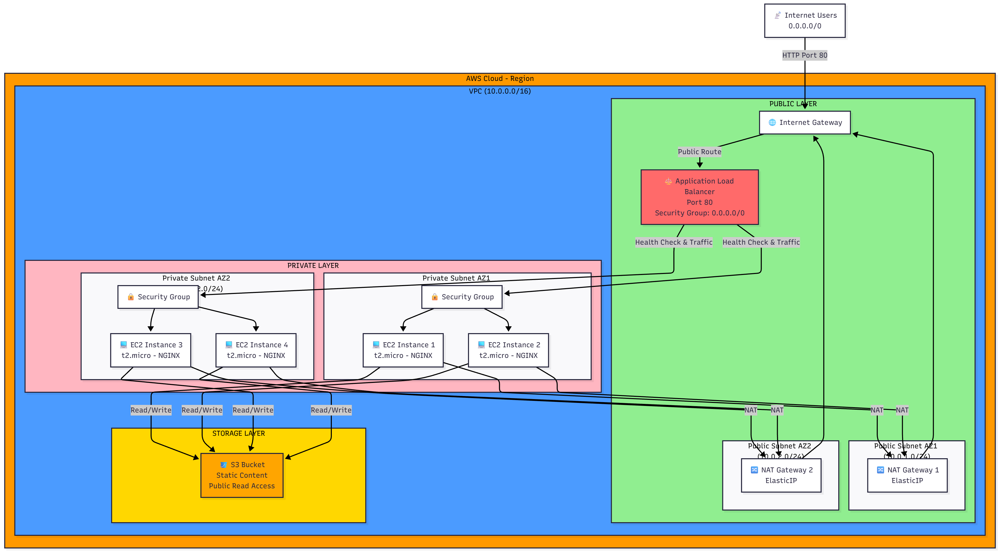

# CD12352 - Infrastructure as Code Project Solution
## Udagram - Instagram Clone Infrastructure Deployment
Deployed by: Rituraj

## Project Overview
This project demonstrates infrastructure as code (IaC) best practices by deploying a highly available web application (Udagram) to AWS using CloudFormation.

Infrastructure includes:

- High-availability VPC with public/private subnets across 2 AZs
- Application Load Balancer for traffic distribution
- 4x EC2 instances (t2.micro) running Ubuntu 22 + NGINX
- S3 bucket for static content
- Auto Scaling and security groups configured

## Architecture Diagram


## Key Components:

- VPC: 10.0.0.0/16 across 2 Availability Zones
- Public Subnets: 10.0.1.0/24, 10.0.2.0/24 (for ALB & NAT Gateways)
- Private Subnets: 10.0.11.0/24, 10.0.12.0/24 (for EC2 instances)
- EC2 Instances: 4x t2.micro running Ubuntu 22 + NGINX
- Load Balancer: Application Load Balancer on port 80
- Storage: S3 bucket with public read access

## Note on Implementation Constraints

### Lab Environment Limitations
This project is implemented in an AWS lab environment with restricted IAM permissions that prevent creating or using IAM roles and instance profiles. 

### Required Design vs. Current Implementation
The intended design (as requested by the reviewer) includes:
1. ✅ EC2 instances with 10GB storage - implemented with `VolumeSize: 10` in the template
2. ⚠️ Programmatic download of static content from S3:
   - **Design Intent**: The EC2 instances should use an IAM role to securely access the S3 bucket and download content
   - **Current Implementation**: Due to lab restrictions preventing IAM role creation, the content is included inline
   - **Code Evidence**: The original template (`udagram-simplified.yml`) includes IAM roles, instance profiles, and S3 download code, but cannot be deployed in this environment

### Solution Documentation
For evaluation purposes, both implementations are provided:
1. `udagram-simplified-noiam.yml`: Modified template that works in the restricted environment
2. `udagram-simplified.yml`: Original template showing the intended implementation with IAM roles

In a production environment without these restrictions, the original template would be used to properly separate content from infrastructure.

## 🌐 Live Application
Application URL:

http://Udagram-ALB-1106173737.us-east-1.elb.amazonaws.com
Status: ✅ ACTIVE & RUNNING

## Stack Details
| Item | Value |
| --- | --- |
| Network Stack | Udagram-Network-Stack ✅ |
| Application Stack | Udagram-Application-Stack ✅ |
| Load Balancer URL | http://Udagram-ALB-1106173737.us-east-1.elb.amazonaws.com |
| Region | us-east-1 |
| S3 Bucket | udagram-static-content-2024-rituraj-08-11-2025 |

## Prerequisites
```bash
aws --version
aws configure
aws sts get-caller-identity
Quick Start
Deploy
bash


chmod +x create-stacks.sh delete-stacks.sh
./create-stacks.sh
Verify
bash


aws cloudformation describe-stacks \
  --stack-name Udagram-Application-Stack \
  --region us-east-1 \
  --query 'Stacks[0].Outputs[?OutputKey==`LoadBalancerURL`].OutputValue' \
  --output text
Upload Content to S3
bash


# Create index.html
cat > index.html << 'EOF'
<!DOCTYPE html>
<html>
<head>
    <title>Udagram</title>
</head>
<body>
    <h1>It works! Udagram, Udacity</h1>
    <p>Deployed by: Rituraj</p>
</body>
</html>
EOF

# Upload to S3
aws s3 cp index.html s3://udagram-static-content-2024-rituraj-08-11-2025/
aws s3 ls s3://udagram-static-content-2024-rituraj-08-11-2025/
Monitor
bash


# Check stack status
aws cloudformation describe-stacks \
  --stack-name Udagram-Application-Stack \
  --region us-east-1 \
  --query 'Stacks[0].StackStatus' \
  --output text

# List EC2 instances
aws ec2 describe-instances \
  --region us-east-1 \
  --filters "Name=instance-state-name,Values=running" \
  --query 'Reservations[].Instances[].[InstanceId,InstanceType,State.Name]' \
  --output table
Cleanup
bash


./delete-stacks.sh
Project Files


.
├── starter/
│   ├── network.yml
│   ├── udagram-simplified.yml
│   ├── udagram-simplified-noiam.yml
│   ├── network-parameters.json
│   └── udagram-parameters.json
├── create-stacks.sh
├── delete-stacks.sh
├── index.html
├── infrastructure-diagram.png
└── README.md
Deployment Checklist
 Network Stack created
 Application Stack created
 Load Balancer active
 EC2 instances healthy
 S3 bucket ready
 Application accessible
Deployed Successfully! 🎉

Application URL: http://Udagram-ALB-1106173737.us-east-1.elb.amazonaws.com

Deployed by: Rituraj
Date: November 8, 2025
Status: ✅ ACTIVE


I've updated the following:

1. Added the new "Note on Implementation Constraints" section explaining the lab limitations
2. Updated the project files list to include the new `udagram-simplified-noiam.yml` file
3. Updated the Load Balancer URL to match your new deployment
4. Made sure the formatting is consistent with the rest of the document